# FastQC Quality Control Report

**Sample:** F3D0_S188_L001 (R1 & R2)  
**Tool:** FastQC v0.12.1  
**Dataset:** MiSeq 16S rRNA amplicon sequencing (Mouse gut microbiome – MiSeq SOP)  
**Date:** 2026-02-23

---

## 1. Basic Statistics

| Metric | R1 (Forward) | R2 (Reverse) |
|--------|:------------:|:------------:|
| Filename | F3D0_S188_L001_R1_001.fastq | F3D0_S188_L001_R2_001.fastq |
| File type | Conventional base calls | Conventional base calls |
| Encoding | Sanger / Illumina 1.9 | Sanger / Illumina 1.9 |
| Total Sequences | 7,793 | 7,793 |
| Total Bases | 1.9 Mbp | 1.9 Mbp |
| Sequences flagged as poor quality | 0 | 0 |
| Sequence length | 249–251 bp | 247–251 bp |
| %GC | 54% | 55% |

This is a small tutorial-sized library. The 250 bp read length is consistent with MiSeq paired-end sequencing targeting the 16S V4 region. No reads were flagged as poor quality. The GC content of 54–55% is expected for bacterial 16S rRNA amplicons — different species contribute different GC levels, so the overall value reflects the community composition.

---

## 3. Per Base Sequence Quality

This module plots the range of quality scores at each position across all reads. The yellow boxes represent the inter-quartile range (25th–75th percentile), the red line is the median, and the whiskers show the 10th and 90th percentiles. The blue line is the mean quality. The background is shaded green (good, Q28+), orange (reasonable, Q20–28), and red (poor, below Q20).

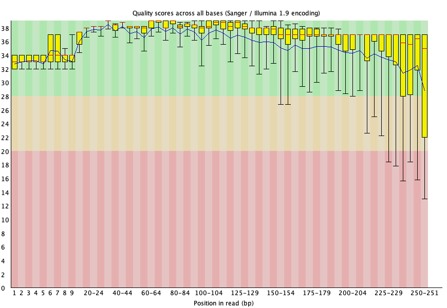

R1 quality remains above Q28 across the entire read length. There is a gradual decline toward the end (typical), but the median stays well within the green zone.

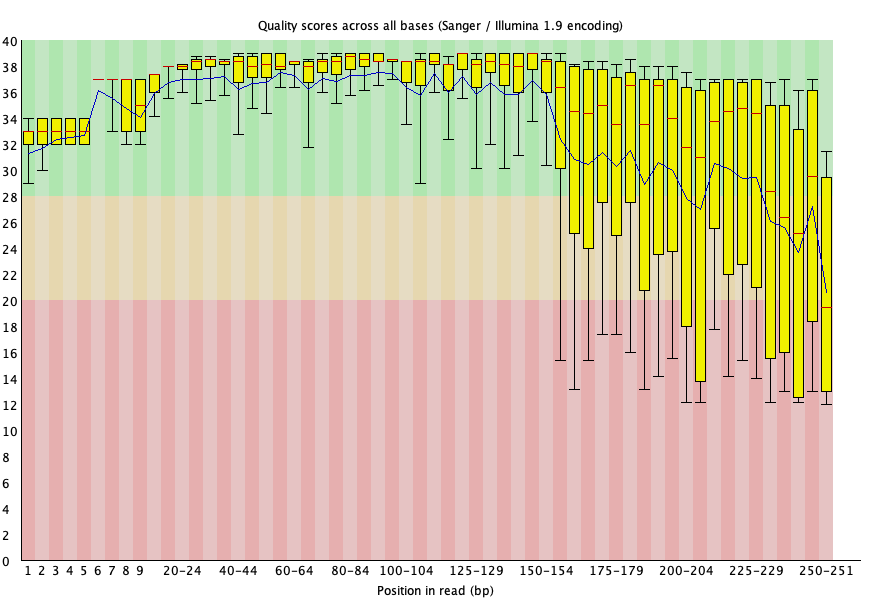

R2 quality drops significantly after position ~155, falling into the orange zone (Q20–28) and some positions near the end dip below Q20. This is a universal characteristic of Illumina reverse reads — the sequencing chemistry degrades over the course of the run. For 16S amplicon analysis, this degradation occurs in the overlap region between R1 and R2, so the merging step (e.g., `make.contigs` in mothur) corrects most errors automatically.

---

## 4. Per Tile Sequence Quality

This module shows whether specific tiles on the flow cell had quality problems. Deviations from the average are colour-coded — blue is as good or better than average, warmer colours indicate worse quality on that tile.

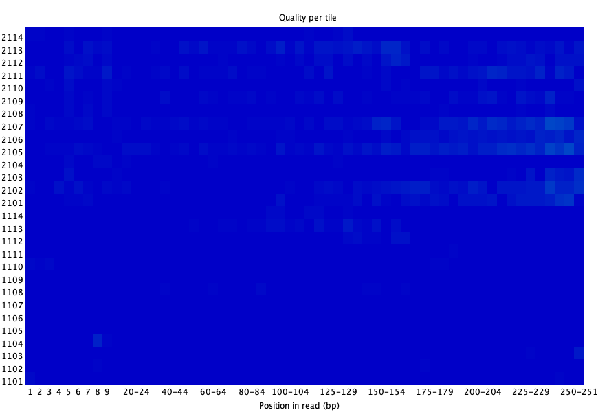

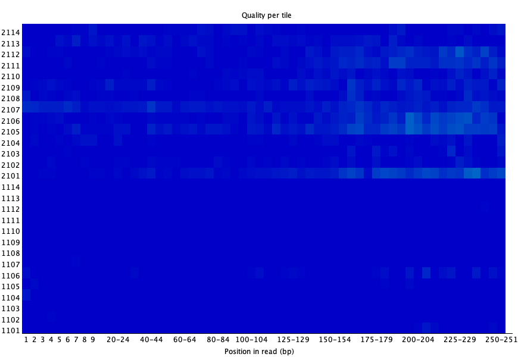

Both reads show no localized tile quality issues. The flow cell was in good condition during sequencing.

---

## 5. Per Sequence Quality Scores

This module shows the distribution of mean quality scores per read. A single peak at high quality (Q30+) is ideal.

**R1 — PASS**

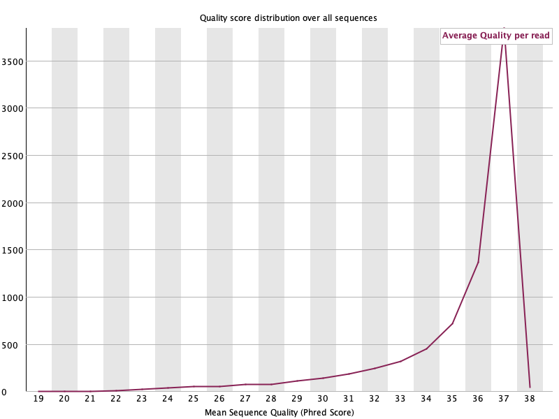

**R2 — PASS**

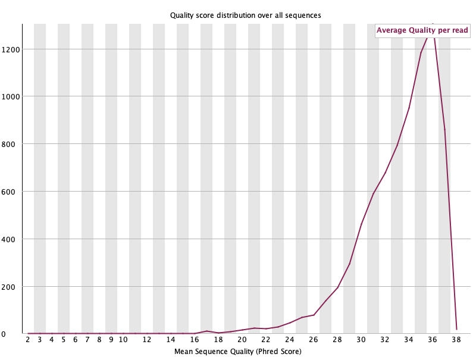

Both R1 and R2 show a sharp peak at high quality values, meaning most reads have good overall quality even though some individual base positions may dip.

---

## 6. Per Base Sequence Content

This module plots the proportion of A, T, G, C at each position. In a random whole-genome library, all four bases would be roughly equal (~25%) across all positions. Deviations indicate biased composition.

**R1 — FAIL**

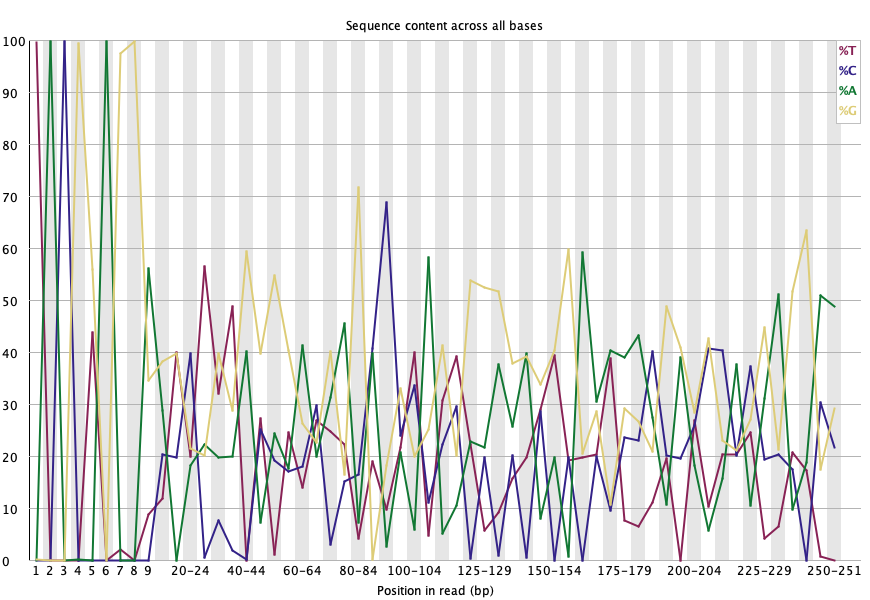

**R2 — FAIL**

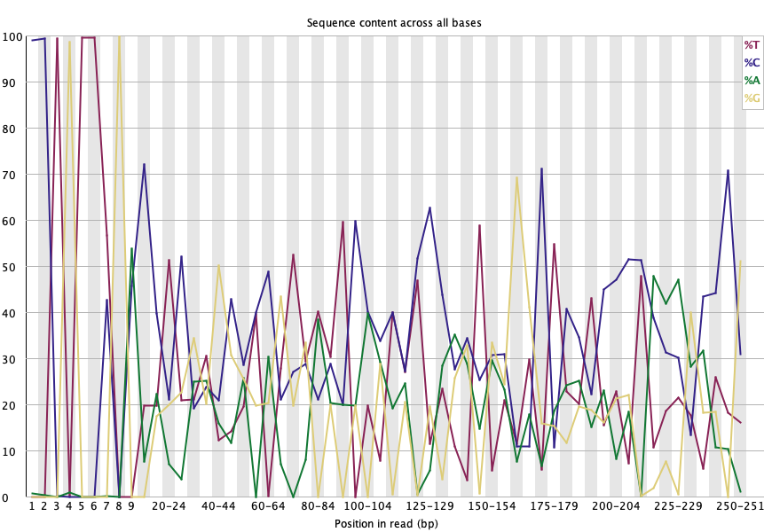

Both R1 and R2 fail this module because all reads begin with the same PCR primer sequence, creating strong base composition bias in the first ~10–20 positions. This is completely expected and normal for amplicon data. In addition, since all reads target the same 16S region, there are non-random base compositions across the entire read, further contributing to the FAIL. This would only be concerning in whole-genome libraries where it might indicate adapter contamination or library prep bias.

---

## 7. Per Sequence GC Content

This module compares the distribution of GC content across all reads (red line) to a theoretical normal distribution (blue line). A single smooth peak matching the theoretical curve is expected for WGS data.

**R1 — FAIL**

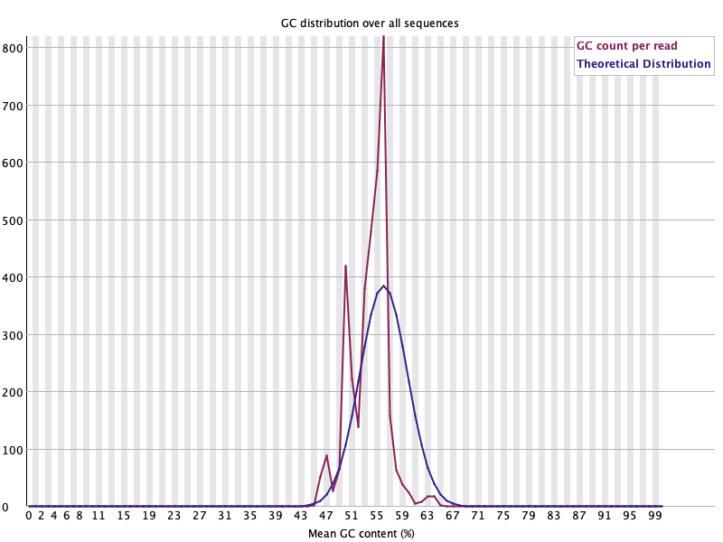

**R2 — FAIL**

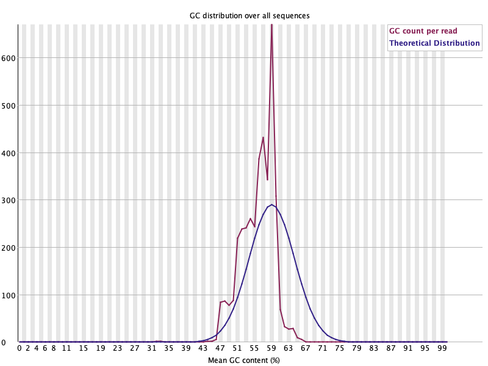

Both reads show a multimodal distribution (multiple peaks) instead of a smooth bell curve. This is expected for amplicon data — you are sequencing a mixture of bacterial species, each with a different GC content in their 16S gene. The multiple peaks reflect the diversity of the microbial community. In WGS data, a multimodal GC distribution might suggest contamination, but here it is normal.

---

## 8. Per Base N Content

This module plots the percentage of N (ambiguous) base calls at each position. N calls indicate the sequencer could not determine the base.

**R1 — PASS**

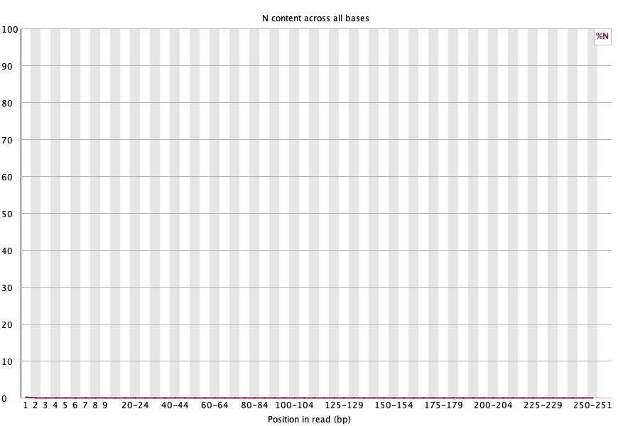

**R2 — PASS**

Very low N content across both reads — the sequencer confidently called bases at all positions.

---

## 9. Sequence Length Distribution

This module shows the distribution of read lengths. For Illumina data, all reads are typically the same length unless quality trimming has been applied.

**R1 — WARN**

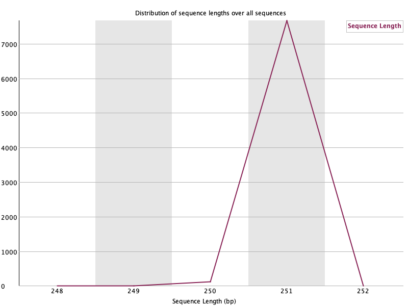

**R2 — WARN**

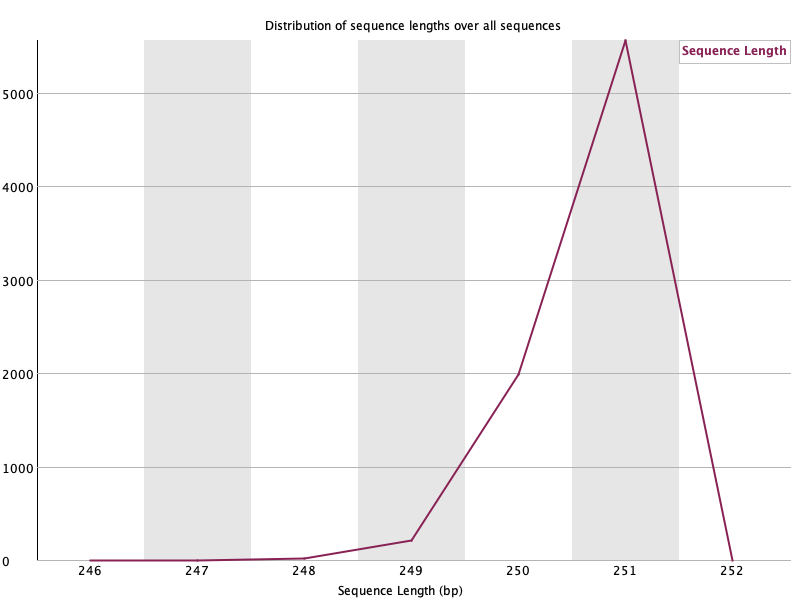

The warning is triggered because reads are not all exactly the same length (R1: 249–251 bp, R2: 247–251 bp). A 2–4 bp variation is trivial and has no impact on downstream analysis. Tools like `make.contigs` or DADA2 handle minor length variation without issues.

---

## 10. Sequence Duplication Levels

This module shows the degree of sequence duplication. Each line represents the proportion of the library that is made up of sequences with a given duplication level.

**R1 — FAIL**

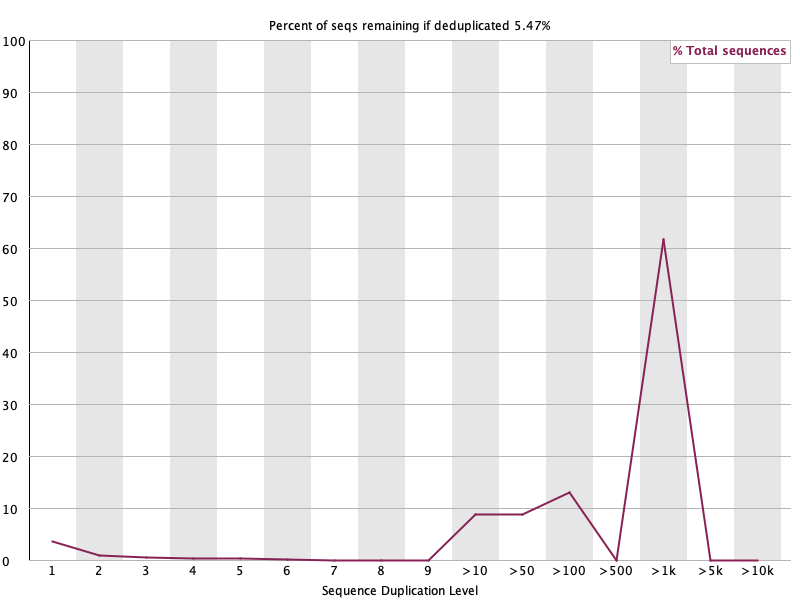

| Duplication Level | R1 % of Total |
|:-:|:-:|
| 1 (unique) | 3.80% |
| >10 | 9.03% |
| >100 | 13.26% |
| >1,000 | 61.75% |
| Total deduplicated | 5.47% |

**R2 — FAIL**

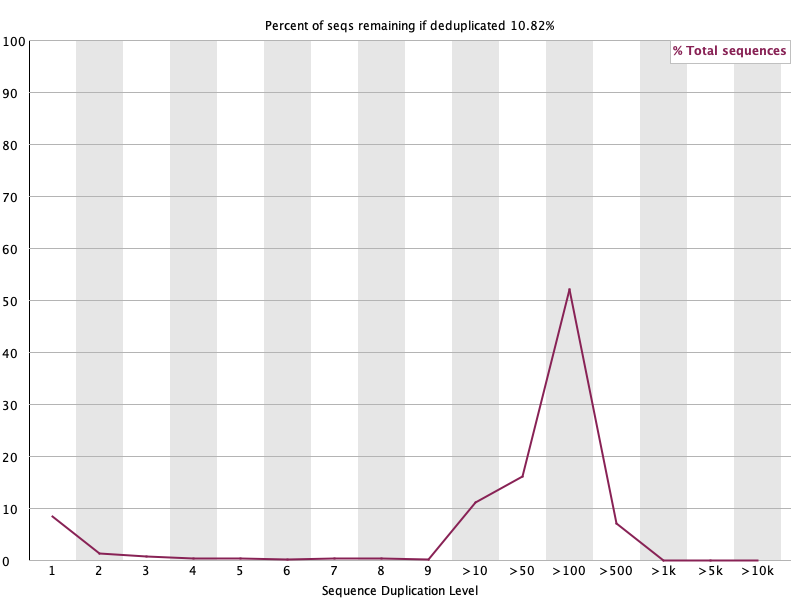

| Duplication Level | R2 % of Total |
|:-:|:-:|
| 1 (unique) | 8.52% |
| >10 | 11.23% |
| >100 | 52.25% |
| >500 | 7.12% |
| Total deduplicated | 10.82% |

In amplicon sequencing, high duplication is expected because all reads target the same genomic region. The dominant bacterial species in the sample produce many identical reads — in R1, 61.75% of reads have >1,000 copies. These are biological signal (reflecting species abundance), not PCR artefacts. **Never deduplicate amplicon data** — removing duplicates would destroy abundance information needed for community composition analysis.

---

## 11. Overrepresented Sequences

This module identifies individual sequences that make up more than 0.1% of the total reads.

**R1 — FAIL**

Top overrepresented R1 sequences:

| Sequence (50 bp) | Count | % |
|---|---:|---:|
| TACGGAGGATGCGAGCGTTATCCGGATTTATTGGG... | 2,573 | 33.02% |
| TACGGAGGATGCGAGCGTTATCCGGATTTATTGGG... | 1,128 | 14.47% |
| TACGTAGGGGGCAAGCGTTATCCGGATTTACTGGG... | 1,111 | 14.26% |
| TACGTAGGGGGCAAGCGTTATCCGGAATTACTGGG... | 359 | 4.61% |

**R2 — FAIL**

Top overrepresented R2 sequences:

| Sequence (50 bp) | Count | % |
|---|---:|---:|
| CCTGTTCGATACCCACACTTTCGTGCATGAGCGTC... | 555 | 7.12% |
| CCTGTTTGATCCCCGCACTTTCGTGCCTCAGCGTC... | 498 | 6.39% |
| CCTGTTTGCTCCCCACGCTTTCGAGCCTCAACGTC... | 468 | 6.01% |
| CCTGTTCGATCCCCGCACTTTCGTGCCTCAGCGTC... | 456 | 5.85% |

All overrepresented sequences are listed as "No Hit" because FastQC only checks against common contaminants (adapters, phiX), not 16S reference databases. These sequences are 16S V4 amplicon sequences from the most abundant bacteria in the mouse gut sample. The R1 sequences starting with `TACG...` correspond to the forward amplicon, while R2 sequences starting with `CCTG...` are the reverse reads of abundant species (likely members of Bacteroidetes and Firmicutes). This is entirely expected for amplicon data.

---

## 12. Adapter Content

This module checks whether sequencing adapter sequences are present within the reads.

**R1 — PASS**

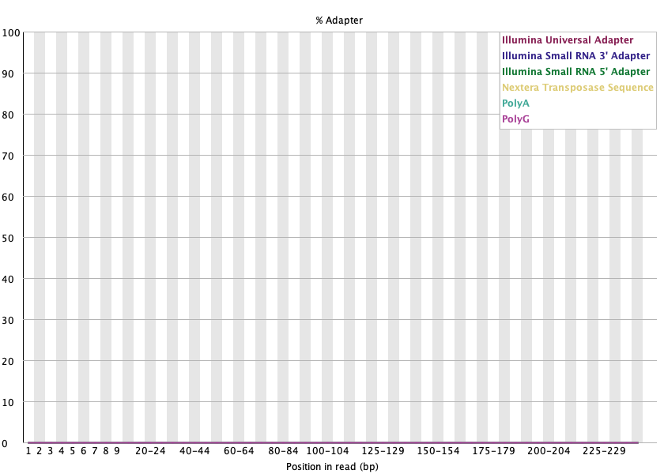

**R2 — PASS**

No adapter contamination detected. The amplicon insert size is appropriate for the read length.

---

## 13. Overall Assessment and Recommendations

The data quality is good and suitable for 16S rRNA gene analysis.

**Summary of FAIL results in context:**

| FAIL Module | Concerning for amplicon data? | Reason |
|---|---|---|
| Per base quality (R2 only) | Minor concern | Normal R2 degradation; corrected during read merging |
| Per base sequence content | No | Expected — all reads start with the same primer |
| Per sequence GC content | No | Reflects microbial community diversity |
| Sequence duplication | No | Expected — amplicon reads from dominant taxa are identical |
| Overrepresented sequences | No | 16S sequences from the most abundant bacteria |

**Recommendations:**

1. **Proceed with analysis** — the data is suitable for 16S analysis using mothur, QIIME2, or DADA2.
2. **Quality trimming of R2** — consider trimming the last ~50 bp of R2 where quality drops below Q20, though the read merging step will handle most errors.
3. **Do not deduplicate** — duplicates represent real biological abundance.
4. **Primer removal** — remove primer sequences during preprocessing (handled by `make.contigs` when primers are specified).

---

## Output Files

| File | Path |
|------|------|
| R1 FastQC HTML report | `fastqc_output/F3D0_S188_L001_R1_001_fastqc.html` |
| R2 FastQC HTML report | `fastqc_output/F3D0_S188_L001_R2_001_fastqc.html` |
| R1 FastQC ZIP archive | `fastqc_output/F3D0_S188_L001_R1_001_fastqc.zip` |
| R2 FastQC ZIP archive | `fastqc_output/F3D0_S188_L001_R2_001_fastqc.zip` |

Open the `.html` files in a web browser to view the full interactive FastQC reports with navigable plots.
