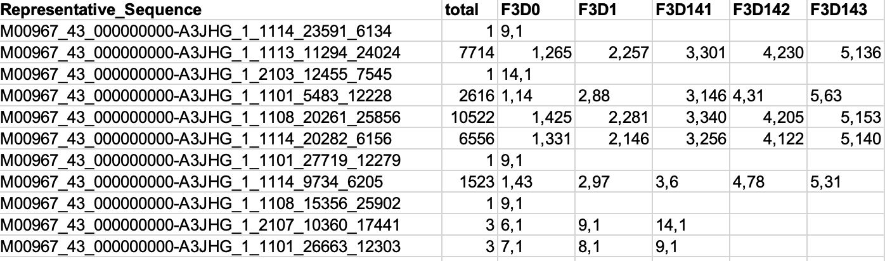

# mothur: unique.seqs

**Command:**

```
mothur > unique.seqs(fasta=stability.trim.contigs.good.fasta, count=stability.contigs.good.count_table)
```

**Date:** 2026-02-23

---

## What this command does

`unique.seqs` finds identical sequences and collapses them into a single representative sequence. The abundance information (how many times each unique sequence appeared in each sample) is tracked in the count table. This dramatically reduces the number of sequences that need to be processed in downstream steps like alignment, chimera detection, and classification.

For example, if 500 reads from different samples all have the exact same nucleotide sequence, `unique.seqs` keeps just one copy and records "500" in the count table. The biological information is preserved — you still know which samples those 500 reads came from and how many were in each sample.

---

## mothur output

```
mothur > unique.seqs(fasta=stability.trim.contigs.good.fasta, count=stability.contigs.good.count_table)

128865  16421

Output File Names:
stability.trim.contigs.good.unique.fasta
stability.trim.contigs.good.count_table
```

The line `128865  16421` means: 128,865 input sequences collapsed into 16,421 unique sequences.

---

## Results

| | Count |
|--|------:|
| Input sequences | 128,865 |
| Unique sequences | 16,421 |
| Duplicate sequences removed | 112,444 |
| Reduction | 87.3% |

87.3% of sequences were duplicates. This is expected for 16S amplicon data — the same bacterial species across multiple samples produce identical amplicon sequences. The dominant taxa in the mouse gut (seen as overrepresented sequences in the FastQC report) account for a large portion of these duplicates.

After this step, mothur only needs to process 16,421 sequences instead of 128,865, which speeds up all downstream computations (alignment, chimera checking, classification) by roughly 8x.

---

## Output files

| File | Description |
|------|-------------|
| `stability.trim.contigs.good.unique.fasta` | 16,421 unique sequences in FASTA format |
| `stability.trim.contigs.good.count_table` | Updated count table mapping each unique sequence to its abundance in each sample |

### Head of count table

`head -18 stability.trim.contigs.good.count_table`:



The count table uses a compressed format: `groupIndex,abundance`. The data shows a range of abundance patterns:

- **Singletons** (total = 1): `..._23591_6134`, `..._12455_7545`, `..._27719_12279`, `..._15356_25902` — each appeared once in a single sample. These are likely sequencing errors or extremely rare taxa.
- **Low-abundance** (total = 3): `..._10360_17441` found in F3D144, F3D147, F3D3 (`6,1  9,1  14,1`). `..._26663_12303` found in F3D145, F3D146, F3D147 (`7,1  8,1  9,1`). Present in only a few samples at abundance 1.
- **Moderate-abundance** (total = 46–702): `..._23954_25916` (46 total, 13 samples), `..._14287_12319` (97 total, 18 samples), `..._19979_17564` (702 total, 19 samples). These are less dominant community members present across most samples.
- **High-abundance** (total = 1,523–7,714): `..._9734_6205` (1,523 total, 19 samples), `..._7289_6221` (4,790 total, 19 samples), `..._11294_24024` (7,714 total, all 20 samples including Mock). Common taxa making up a significant portion of the community.
- **Dominant taxa** (total = 10,522): `..._20261_25856` appeared in 19 of 20 samples (absent from Mock) with the highest abundance — 2,650 reads in F3D2 alone. This is likely one of the most abundant bacteria in the mouse gut.

---

## Next step

The next step in the MiSeq SOP is to run `summary.seqs` on the unique sequences, then align them to a reference database:

```
mothur > summary.seqs(fasta=stability.trim.contigs.good.unique.fasta, count=stability.trim.contigs.good.count_table)
```

Followed by alignment to the SILVA reference:

```
mothur > align.seqs(fasta=stability.trim.contigs.good.unique.fasta, reference=silva.bacteria/silva.bacteria.fasta)
```
