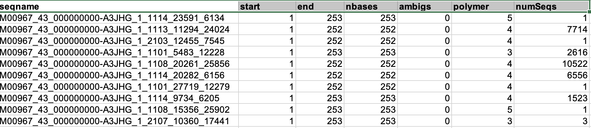

# mothur: summary.seqs (post-filtering)

**Command:**

```
mothur > summary.seqs(fasta=stability.trim.contigs.good.unique.fasta, count=stability.trim.contigs.good.count_table, processors=4)
```


---

## What this command does

This is the second run of `summary.seqs`, now on the cleaned and deduplicated sequences. It confirms that the filtering steps (`screen.seqs` + `unique.seqs`) produced a clean dataset ready for alignment. The count table is included so that the percentiles reflect the true abundance-weighted distribution, not just unique sequence counts.

---

## mothur output

```
mothur > summary.seqs(fasta=stability.trim.contigs.good.unique.fasta, count=stability.trim.contigs.good.count_table, processors=4)

Using 4 processors.

                Start   End     NBases  Ambigs  Polymer NumSeqs
Minimum:        1       250     250     0       3       1
2.5%-tile:      1       252     252     0       3       3222
25%-tile:       1       252     252     0       4       32217
Median:         1       252     252     0       4       64433
75%-tile:       1       253     253     0       5       96649
97.5%-tile:     1       253     253     0       6       125644
Maximum:        1       270     270     0       8       128865
Mean:           1       252     252     0       4
# of unique seqs:       16421
total # of seqs:        128865

It took 3 secs to summarize 128865 sequences.

Output File Names:
stability.trim.contigs.good.unique.summary
```

---

## Comparison: before vs after filtering

| Metric | Before (raw contigs) | After (screened + unique) |
|--------|:--------------------:|:------------------------:|
| Total sequences | 152,360 | 128,865 |
| Unique sequences | 152,360 | 16,421 |

The filtering removed all sequences with ambiguous bases (now max = 0), trimmed the length range (502 → 270), and capped homopolymers at 8. The dataset is now clean — 128,865 total sequences represented by 16,421 unique sequences.

---

## Output file

| File | Description |
|------|-------------|
| `stability.trim.contigs.good.unique.summary` | Per-sequence statistics for the cleaned, deduplicated dataset |

### Head of summary file

`head stability.trim.contigs.good.unique.summary`:



The summary file has one row per unique sequence with columns: seqname, start, end, nbases, ambigs, polymer, and numSeqs (abundance from the count table). All sequences start at position 1, have 0 ambiguous bases, and the numSeqs column shows how many total reads each unique sequence represents.

---

## Next step

Align unique sequences to the SILVA reference database:

```
mothur > align.seqs(fasta=stability.trim.contigs.good.unique.fasta, reference=silva.v4.fasta)
```
