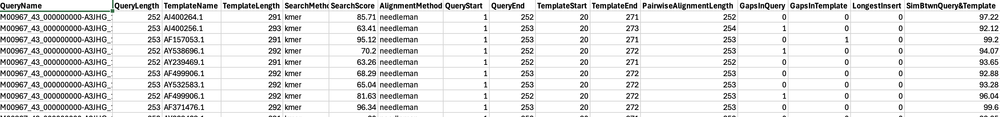

# mothur: pcr.seqs + align.seqs


---

## Background: What is the SILVA reference?

**SILVA** (from Latin *silva* = forest) is a comprehensive, quality-checked database of ribosomal RNA (rRNA) gene sequences maintained by the [Leibniz Institute DSMZ](https://www.arb-silva.de/) in Germany. It provides curated **structural alignments** of SSU (16S/18S) and LSU (23S/28S) rRNA sequences.

The version in this project (`silva.bacteria.fasta`) contains **14,956 bacterial 16S sequences**, all pre-aligned to a common coordinate system of ~50,000 columns.

### Why alignment (not just BLAST)?

Unlike a simple BLAST database, SILVA sequences are **structurally aligned** — every column represents the **same biological position** across all bacteria:

```
Unaligned:      ATCG--TTAC        (you don't know what matches what)
SILVA-aligned:  ..AT-CG..TTAC..  (column 5 = same position in every bacterium)
```

When you later cluster sequences into OTUs or calculate distances, every sequence must be in the same coordinate frame. SILVA's pre-computed alignment provides that frame — mothur slots your sequences into it via `align.seqs`.

### The coordinates 11895–25318

The full SILVA alignment is ~50,000 columns, but the V4 amplicon only covers a small region:

```
Full SILVA:  |----------- 50,000 columns ----------|
V4 region:          |---11895------25318---|
                          ↑ your data ↑
```

These numbers correspond to the **E. coli** 16S rRNA gene positions where the V4 primers (515F/806R) bind. Different hypervariable regions (V1–V2, V3–V4, etc.) would use different coordinates.

### How SILVA is used in this pipeline

| Step | What SILVA does |
|------|----------------|
| `pcr.seqs` | Extracts just the V4 window from the full alignment |
| `align.seqs` | Places your sequences into SILVA's coordinate system |
| `screen.seqs` (next) | Uses alignment positions (start=1968, end=11550) to remove mis-aligned sequences |
| `filter.seqs` (later) | Removes gap-only columns to speed up computation |
| `chimera.vsearch` | Uses aligned sequences to detect chimeric sequences |

---

## Step 1: Extract V4 region from SILVA reference (pcr.seqs)

**Command:**

```
mothur > pcr.seqs(fasta=silva.bacteria.fasta, start=11895, end=25318, keepdots=F)
```

`pcr.seqs` extracts the V4 window from the full SILVA alignment (as described above), producing a compact reference. The `keepdots=F` option removes leading/trailing dot characters so the output only contains the V4 region.

### mothur output

```
mothur > pcr.seqs(fasta=silva.bacteria.fasta, start=11895, end=25318, keepdots=F)

Using 10 processors.

[NOTE]: no sequences were bad, removing silva.bacteria.bad.accnos

It took 27 secs to screen 14956 sequences.

Output File Names:
silva.bacteria.pcr.fasta
```

All 14,956 SILVA bacterial sequences had coverage across the V4 region — none were removed. The output was renamed to `silva.v4.fasta`.

---

## Step 2: Align sequences to V4 reference (align.seqs)

**Command:**

```
mothur > align.seqs(fasta=stability.trim.contigs.good.unique.fasta, reference=silva.v4.fasta, processors=4)
```

### What this command does

`align.seqs` uses the Needleman-Wunsch global alignment algorithm to align each of the 16,421 unique sequences against the 14,956 SILVA V4 reference sequences. For each query sequence, mothur finds the best-matching reference sequence and inserts gaps to create a multiple sequence alignment. This alignment is essential because:

1. **Positional homology** — ensures that the same column in the alignment represents the same biological position across all sequences
2. **Downstream analysis** — OTU clustering, phylogenetic analysis, and chimera detection all require aligned sequences
3. **Consistent coordinates** — allows filtering and trimming based on alignment positions

### mothur output

```
mothur > align.seqs(fasta=stability.trim.contigs.good.unique.fasta, reference=../silva.bacteria/silva.v4.fasta, processors=4)

Using 4 processors.

Reading in the silva.v4.fasta template sequences...  DONE.
It took 3 to read 14956 sequences.

Aligning sequences from stability.trim.contigs.good.unique.fasta ...
It took 12 seconds to align 16421 sequences.

Output File Names:
stability.trim.contigs.good.unique.align
stability.trim.contigs.good.unique.align_report
```

---

## Output files

| File | Description |
|------|-------------|
| `silva.v4.fasta` | SILVA reference trimmed to V4 region (14,956 sequences) |
| `stability.trim.contigs.good.unique.align` | 16,421 aligned unique sequences |
| `stability.trim.contigs.good.unique.align_report` | Per-sequence alignment quality metrics (see below) |

### Head of alignment report

`head stability.trim.contigs.good.unique.align_report`:



Key columns explained:

- **QueryName** — sequence name
- **QueryLength** — length of your sequence (252–253 bp)
- **TemplateName** — best-matching SILVA reference sequence (e.g., AJ400264.1)
- **TemplateLength** — length of the reference sequence (291–293 bp)
- **SearchMethod** — `kmer` (k-mer search to find the closest reference)
- **SearchScore** — how well the query matched the template during the initial search (63–96%)
- **AlignmentMethod** — `needleman` (Needleman-Wunsch global alignment)
- **QueryStart/QueryEnd** — alignment coordinates within the query (1–252/253)
- **TemplateStart/TemplateEnd** — alignment coordinates within the template (20–271/273)
- **PairwiseAlignmentLength** — length of the pairwise alignment (252–254 bp)
- **GapsInQuery/GapsInTemplate** — number of gaps inserted (0–1, very few)
- **LongestInsert** — longest insertion in the query relative to the template (0 for all)
- **SimBtwn Query&Template** — similarity between query and best reference (92–99%)

---

## Step 3: Check alignment positions (summary.seqs)

**Command:**

```
mothur > summary.seqs(fasta=stability.trim.contigs.good.unique.align, count=stability.trim.contigs.good.count_table, processors=4)
```

### mothur output

```
                Start   End     NBases  Ambigs  Polymer NumSeqs
Minimum:        1250    10693   250     0       3       1
2.5%-tile:      1968    11550   252     0       3       3222
25%-tile:       1968    11550   252     0       4       32217
Median:         1968    11550   252     0       4       64433
75%-tile:       1968    11550   253     0       5       96649
97.5%-tile:     1968    11550   253     0       6       125644
Maximum:        1982    13400   270     0       8       128865
Mean:           1967    11550   252     0       4
# of unique seqs:       16421
total # of seqs:        128865
```

### Interpretation

The Start and End columns now show **alignment coordinates** (positions in the SILVA V4 reference), not sequence positions:

- **95% of sequences** start at position **1968** and end at **11550** — this is the expected V4 region
- A few outliers start at position 1250 (earlier than expected) or end at 13400 (later than expected) — these are likely non-specific amplification products or sequences that didn't align well
- **NBases** (250–270) confirms the actual sequence lengths haven't changed
- **Ambigs = 0** and **Polymer ≤ 8** confirm the filtering is still intact

---

## Step 4: Screen aligned sequences (screen.seqs)

**Command:**

```
mothur > screen.seqs(fasta=stability.trim.contigs.good.unique.align, count=stability.trim.contigs.good.count_table, start=1968, end=11550, processors=4)
```

This removes any sequence that doesn't start at or before position 1968, or doesn't end at or after position 11550 in the alignment. These are sequences that didn't align properly to the V4 region — they may be non-specific products, chimeras, or non-16S contamination.

### mothur output

```
mothur > screen.seqs(fasta=stability.trim.contigs.good.unique.align, count=stability.trim.contigs.good.count_table, start=1968, end=11550, processors=4)

Using 4 processors.

It took 8 secs to screen 16421 sequences, removed 122.

Running command: remove.seqs(accnos=stability.trim.contigs.good.unique.bad.accnos.temp, count=stability.trim.contigs.good.count_table)
Removed 209 sequences from stability.trim.contigs.good.count_table.

Output File Names:
stability.trim.contigs.good.unique.good.align
stability.trim.contigs.good.unique.bad.accnos
stability.trim.contigs.good.good.count_table
```

### Filtering results

| | Unique seqs | Total seqs |
|--|------:|------:|
| Input | 16,421 | 128,865 |
| Removed | 122 | 209 |
| Kept | 16,299 | 128,656 |

Only 122 unique sequences (209 total) were removed — 99.8% of sequences aligned correctly to the V4 region. This confirms the alignment was successful and very few non-target sequences remain.

### Output files

| File | Description |
|------|-------------|
| `stability.trim.contigs.good.unique.good.align` | 16,299 aligned sequences that passed the screen |
| `stability.trim.contigs.good.unique.bad.accnos` | Names of the 122 removed sequences |
| `stability.trim.contigs.good.good.count_table` | Updated count table (128,656 total sequences) |

---

## Next step

Filter the alignment to remove gap-only columns, then re-deduplicate:

```
mothur > filter.seqs(fasta=stability.trim.contigs.good.unique.good.align, vertical=T, trump=.)
```
