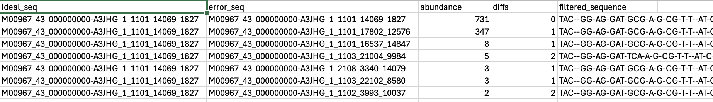

# mothur: pre.cluster

**Command:**

```
mothur > pre.cluster(fasta=stability.trim.contigs.good.unique.good.filter.unique.fasta, count=stability.trim.contigs.good.unique.good.filter.count_table, diffs=2, processors=4)
```


---

## What this command does

Amplicon sequencing inherently introduces small errors (point mutations) during PCR and sequencing. These errors artificially inflate the number of unique sequences and OTUs.

`pre.cluster` uses a pseudo-single linkage algorithm developed by Huse et al. (2010) to "denoise" the data. It sorts sequences by abundance, then merges rarer sequences into more abundant sequences if they differ by at most `diffs` base pairs.

For the ~250 bp V4 region, allowing `diffs=2` (1 error per 100 bp) effectively removes these artificial sequencing errors while preserving true biological variation.

---

## mothur output

```
mothur > pre.cluster(fasta=stability.trim.contigs.good.unique.good.filter.unique.fasta, count=stability.trim.contigs.good.unique.good.filter.count_table, diffs=2, processors=4)

Using 4 processors.
Selected 6090 sequences from stability.trim.contigs.good.unique.good.filter.unique.fasta.

It took 3 secs to run pre.cluster.

Output File Names: 
stability.trim.contigs.good.unique.good.filter.unique.precluster.fasta
stability.trim.contigs.good.unique.good.filter.unique.precluster.count_table
... (and individual .map files for each sample)
```

### Checking the results (summary.seqs)

```
mothur > summary.seqs(fasta=stability.trim.contigs.good.unique.good.filter.unique.precluster.fasta, count=stability.trim.contigs.good.unique.good.filter.unique.precluster.count_table)

                Start   End     NBases  Ambigs  Polymer NumSeqs
Minimum:        1       376     249     0       3       1
2.5%-tile:      1       376     252     0       3       3217
25%-tile:       1       376     252     0       4       32165
Median:         1       376     252     0       4       64329
75%-tile:       1       376     253     0       5       96493
97.5%-tile:     1       376     253     0       6       125440
Maximum:        1       376     256     0       8       128656
Mean:           1       376     252     0       4
# of unique seqs:       6090
total # of seqs:        128656
```

### Denoising results

| | Unique seqs | Total seqs |
|--|------:|------:|
| Input | 16,296 | 128,656 |
| Output | 6,090 | 128,656 |

Denoising reduced the number of unique sequences by **62.6%** (from 16,296 to 6,090), without losing any total sequences. This means that nearly two-thirds of our previously "unique" sequences were actually just sequencing errors (differing by 1-2 bases) of more abundant "parent" sequences.

---

## Output files

| File | Description |
|------|-------------|
| `*.precluster.fasta` | Denoised multiple sequence alignment |
| `*.precluster.count_table` | Updated count table mapped to the 6,090 denoised sequences |
| `*.map` files | Maps showing exactly which sequence IDs were merged into which parent IDs for each sample |

### Inside a .map file

A `.map` file (e.g., `stability.trim.contigs.good.unique.good.filter.unique.precluster.F3D0.map`) shows exactly what `pre.cluster` did under the hood.



The columns represent:

1. **ideal_seq** — The parent sequence (the central, dominant sequence of the cluster). For example, `M00967..._14069_1827` in this image.
2. **error_seq** — The sequence being mapped. Notice that the first row is the `ideal_seq` mapping to *itself*, with 0 diffs. Subsequent rows are child sequences containing errors (e.g., `M00967..._17802_12576` which has 1 diff from the ideal seq).
3. **abundance** — The number of copies of this distinct `error_seq` found in the sample. For example, there are 731 copies of the parent string, 347 of the first child, 8 of the second child, and 5 of the child with 2 errors.
4. **diffs** — The number of base pair differences between the `error_seq` and the `ideal_seq`. As shown, this is `0` for the parent itself, and `1` or `2` for the child sequences.
5. **filtered_sequence** — The actual nucleotide sequence data for the `error_seq` listed in that row.

---

## Next step

Remove chimeras (artifacts where two distinct sequences fused during PCR):

```
mothur > chimera.vsearch(fasta=stability.trim.contigs.good.unique.good.filter.unique.precluster.fasta, count=stability.trim.contigs.good.unique.good.filter.unique.precluster.count_table, dereplicate=t)
```
