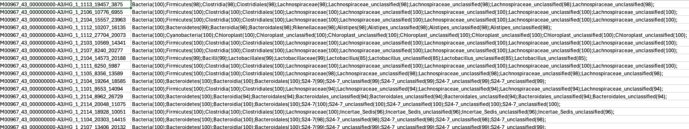
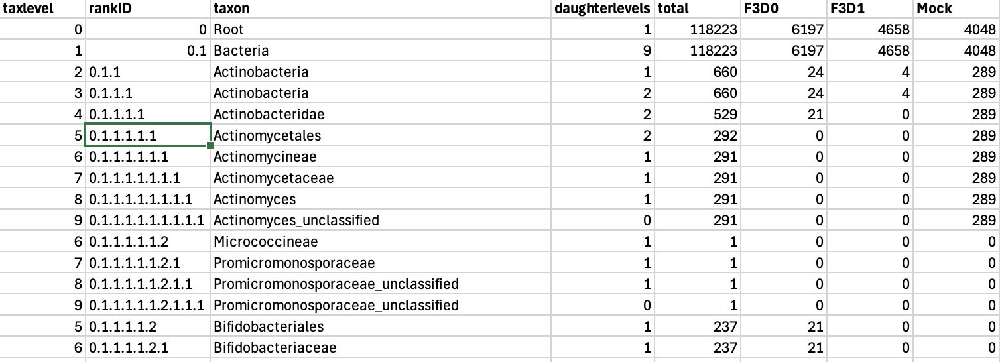

# mothur: classify.seqs

**Command:**

```
mothur > classify.seqs(fasta=stability.trim.contigs.good.unique.good.filter.unique.precluster.denovo.vsearch.fasta, count=stability.trim.contigs.good.unique.good.filter.unique.precluster.denovo.vsearch.count_table, reference=../silva.bacteria/silva.bacteria.fasta, taxonomy=../silva.bacteria/silva.bacteria.silva.tax, cutoff=80, processors=4)
```


---

## What this command does

To ensure we are only analyzing the intended biological target (e.g., bacterial 16S RNA, though this dataset appears to be 18S), we need to determine the taxonomic identity of our high-quality sequences.

The `classify.seqs` command uses the Wang method (a naive Bayesian classifier) to assign taxonomy to each sequence:

- It compares the 8-mers (subsequences of 8 bases) of our sequences against the SILVA reference database.
- The `cutoff=80` parameter requires an 80% bootstrap confidence threshold for an assignment to be made at any given taxonomic level. If the confidence falls below 80% for a specific rank (like Genus), the sequence is classified as "unclassified" at that rank and all deeper ranks.

---

## mothur output

```
mothur > classify.seqs(fasta=stability.trim.contigs.good.unique.good.filter.unique.precluster.denovo.vsearch.fasta, count=stability.trim.contigs.good.unique.good.filter.unique.precluster.denovo.vsearch.count_table, reference=../silva.bacteria/silva.bacteria.fasta, taxonomy=../silva.bacteria/silva.bacteria.silva.tax, cutoff=80, processors=4)

Using 4 processors.
Generating search database...    DONE.
It took 23 seconds generate search database.

Reading in the /Volumes/CrucialX6/18s_rRNA/silva.bacteria/silva.bacteria.silva.tax taxonomy...  DONE.
Calculating template taxonomy tree...     DONE.
Calculating template probabilities...     DONE.
It took 32 seconds get probabilities.

Classifying sequences from stability...fasta ...
...
It took 4 secs to classify 2508 sequences.
It took 0 secs to create the summary file for 2508 sequences.

Output File Names: 
stability.trim.contigs.good.unique.good.filter.unique.precluster.denovo.vsearch.silva.wang.taxonomy
stability.trim.contigs.good.unique.good.filter.unique.precluster.denovo.vsearch.silva.wang.tax.summary
```

---

## Output files

| File | Description |
|------|-------------|
| `*.silva.wang.taxonomy` | A list of every sequence ID and its full taxonomic lineage (with bootstrap confidence scores in parentheses). |
| `*.silva.wang.tax.summary` | A highly useful summary table counting the number of sequences assigned to each taxonomic group at every level, properly weighted by the `.count_table`. |

### 1. The `.taxonomy` file (`vserach2.png`)



This file (`stability.trim.contigs.good.unique.good.filter.unique.precluster.denovo.vsearch.silva.wang.taxonomy`) lists the exact taxonomic lineage for every single unique sequence.

- **Column 1:** The sequence ID (e.g., `M00967_43..._19457_3875`).
- **Column 2:** The full lineage assigned to that sequence, separated by semicolons.
- **Confidence Scores:** The numbers in parentheses (e.g., `(100)`, `(98)`) represent the bootstrap confidence that the classification at that specific level is correct. If the score drops below our `cutoff=80` threshold, the sequence is binned as "unclassified" for that level and all lower levels.

### 2. The `.tax.summary` file (`vsearch.png`)



This file (`stability.trim.contigs.good.unique.good.filter.unique.precluster.denovo.vsearch.silva.wang.tax.summary`) is a summarized view of the entire dataset's taxonomy, split by sample.

- **taxlevel:** The hierarchical depth (0 = Root, 1 = Domain, 2 = Phylum, etc.).
- **rankID / taxon:** The numerical lineage path (`rankID`) mapping down to the specific taxonomic group (`taxon`). Because biology is hierarchical, `rankID` provides a structured numerical address for every taxon:
  - `0.1` = Bacteria
  - `0.1.1` = Actinobacteria (the 1st Phylum under Bacteria)
  - `0.1.1.1` = Actinobacteria (the 1st Class under the Actinobacteria Phylum)
  - `0.1.1.1.1` = Actinobacteridae (the 1st Subclass)
  - `0.1.1.1.1.1` = Actinomycetales (the 1st Order)
  - `0.1.1.1.1.1.1` = Actinomycineae (the 1st Suborder)
  - `0.1.1.1.1.1.1.1` = Actinomycetaceae (the 1st Family)
  - `0.1.1.1.1.1.1.1.1` = Actinomyces (the 1st Genus)
- **daughterlevels:** The number of child taxa directly beneath this specific group that actually appear in your dataset. For example, if `Bacteria` has a `daughterlevels` of 9, it means there are 9 different Phyla present under Bacteria in your specific samples.
- **total:** The total number of sequences in the entire dataset belonging to this group.
- **F3D0, F3D1, Mock, etc.:** The breakdown of how many sequences belonging to this group are in each specific sample.

This summary is incredibly useful for getting a high-level view of your community composition before even doing any downstream analysis in R!

---

## Next step

Remove any sequences classifying to unwanted lineages (such as Chloroplasts, Mitochondria, Archaea, Eukaryota, or completely unknown domains):

```
mothur > remove.lineage(fasta=stability.trim.contigs.good.unique.good.filter.unique.precluster.denovo.vsearch.fasta, count=stability.trim.contigs.good.unique.good.filter.unique.precluster.denovo.vsearch.count_table, taxonomy=stability.trim.contigs.good.unique.good.filter.unique.precluster.denovo.vsearch.silva.wang.taxonomy, taxon=Chloroplast-Mitochondria-unknown-Archaea-Eukaryota)
```
