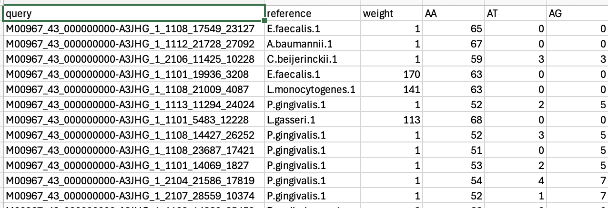

# mothur: seq.error

**Command:**

```
mothur > seq.error(fasta=stability.trim.contigs.good.unique.good.filter.unique.precluster.denovo.vsearch.pick.fasta, count=stability.trim.contigs.good.unique.good.filter.unique.precluster.denovo.vsearch.pick.count_table, reference=HMP_MOCK.v35.fasta, aligned=F)
```


---

## What this command does

Having completely curated our sequence dataset (quality filtering, alignment, denoising, chimera removal, and lineage filtering), it is time to ask: **"Just how good is our curated data?"**

Because we sequenced a "Mock Community" (a synthetic community where we already know the exact "true" sequences of the organisms in the tube), we can isolate those sequences and compare them against those true reference sequences. Any discrepancy between what we sequenced and what the true reference says *must* be a sequencing error.

First, we use `get.groups` to pull out only the sequences belonging to our `Mock` sample. Then, we use the `seq.error` command to calculate a concrete error rate for our entire pipeline.

---

## mothur output

### 1. Extract the Mock community

```
mothur > get.groups(count=stability.trim.contigs.good.unique.good.filter.unique.precluster.denovo.vsearch.pick.count_table, fasta=stability.trim.contigs.good.unique.good.filter.unique.precluster.denovo.vsearch.pick.fasta, groups=Mock)

Selected 4048 sequences from your count file.
Selected 64 sequences from your fasta file.
```

### 2. Assess the error rate

```
mothur > seq.error(fasta=stability.trim.contigs.good.unique.good.filter.unique.precluster.denovo.vsearch.pick.pick.fasta, count=stability.trim.contigs.good.unique.good.filter.unique.precluster.denovo.vsearch.pick.pick.count_table, reference=HMP_MOCK.v35.fasta, aligned=F)

Multiply error rate by 100 to obtain the percent sequencing errors.
Overall error rate:     6.5108e-05

Errors  Sequences
0       3998
1       3
...
```

---

## Output files

The `seq.error` command actually generates **8 files** in total for each run. For better organization, we moved all these files into a new subdirectory called **`seq_error_output/`**.

| File | Description |
|------|-------------|
| `*.error.summary` | Contains the calculated overall error rate for the sequencing run (most important). |
| `*.error.matrix` | Details the specific types of nucleotide substitutions or insertions/deletions that caused the errors. |
| `*.error.seq` | Maps the specific errors found in individual sequences. |
| `*.error.count` | Table of error counts for sequences. |
| `*.error.chimera` | Summary of remaining chimeric sequences (if any escaped earlier curation). |
| `*.error.ref` | FastA file connecting query sequences to their specific matched reference sequence. |
| `*.error.seq.forward` | Forward directional errors detailed specifically. |
| `*.error.seq.reverse` | Reverse directional errors detailed specifically. |

### Interpretation

The `seq.error` command calculated an **Overall error rate: 0.000065** (which is **0.0065%** after multiplying by 100)!

This means that out of all the bases sequenced across those 4,048 mock community sequences, virtually all of them match the known true references perfectly.

As shown in the error table output, **3,998 of the sequences had 0 errors**, while just 3 sequences had exactly 1 error.


The screenshot above is a view into the **`*.error.seq`** file that `seq.error` generates. This file gives you an incredibly granular look at mistakes on a sequence-by-sequence basis:

- **`query`:** Your assigned sequence ID.
- **`reference`:** The specific known Mock community bacterial species that your sequence aligned to (e.g., `E.faecalis.1` or `A.baumannii.1`).
- **`weight`:** The abundance (count) of this exact sequence in your dataset.
- **`AA`, `AT`, `AG`, etc.:** These columns track exactly what kind of sequencing substitution errors occurred. For example, if the reference sequence was an `A` but your Illumina read called it a `T`, it gets tallied under the `AT` column. In the screenshot, the `AA`, `TT`, `CC`, `GG` columns represent perfectly matching bases, while mixed letter columns like `AT` or `AG` represent substitution errors!

This is a phenomenally clean dataset. Our sequence curation process was incredibly successful.-

## Next step

Now that sequence curation and error estimation are complete, the final phase of the pipeline is **clustering** the high-quality sequences into OTUs (Operational Taxonomic Units) or ASVs (Amplicon Sequence Variants) to prepare for ecological analysis.
