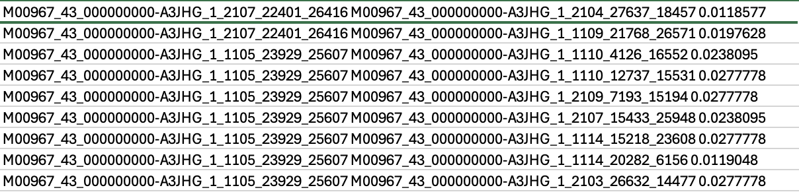
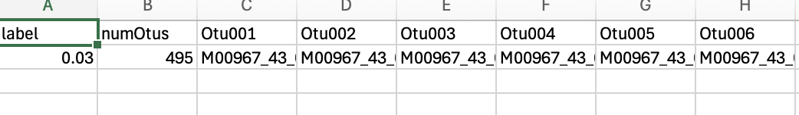

# mothur: OTU Clustering

**Commands:**

```
mothur > dist.seqs(fasta=final.fasta, cutoff=0.03)

mothur > cluster(column=final.dist, count=final.count_table)
```


---

## What this process does

Up until now, every single step in our pipeline has operated on **unique sequences** (exact 100% matches). However, due to natural biological variation, sequencing machine errors, and evolutionary drift, two microbes that belong to the exact same species might have 16S sequences that differ by a few base pairs.

To perform ecological analyses (like calculating alpha/beta diversity), we typically clump highly-similar sequences together into Operational Taxonomic Units (OTUs).

The standard definition of an OTU is a cluster of sequences that are at least **97% similar** to one another (which is why we use a `cutoff=0.03` distance limit).

1. **`dist.seqs`:** Mathematically calculates the pairwise genetic distance (number of mismatches/gaps) between every single unique sequence in our `final.fasta` file. It only saves distances that are closer than the 0.03 cutoff to save memory.
2. **`cluster`:** Uses the `opticlust` algorithm (designed by the `mothur` team) to read that distance matrix and optimally group the sequences into distinct OTUs based on the 97% similarity rule.

---

## mothur output

### 1. Distance matrix generation

```
mothur > dist.seqs(fasta=final.fasta, cutoff=0.03)

Using 10 processors.
...
It took 2 secs to find distances for 2457 sequences. 26791 distances below cutoff 0.03.

Output File Names: 
final.dist
```

### 2. Opticlust clustering

```
mothur > cluster(column=final.dist, count=final.count_table)

...
iter    time    label   num_otus        cutoff  tp      tn      fp      fn      sensitivity     specificity     ppv     npv     fdr     accuracy        mcc     f1score

0.03
0       0       0.03    2457    0.03    ...
1       0       0.03    535     0.03    ...
...
5       0       0.03    495     0.03    ...

It took 0 seconds to cluster

Output File Names: 
final.opti_mcc.list
final.opti_mcc.steps
final.opti_mcc.sensspec
```

### Interpretation

The `opticlust` algorithm ran through 5 iterations of grouping to find the mathematically optimal clustering arrangement.

By the final iteration (`iter 5`), it had successfully clustered the 2,498 unique sequences into **495 OTUs**!

This means that our entire biological dataset consists of approximately 495 distinct microbial "species".

---

## Output files

Below is a detailed look at the core files generated during this clustering step, using screenshots to demonstrate their structure:

### 1. The Distance Matrix (`final.dist`)



This file (`otu2.png`) is the massive pairwise distance matrix computed by `dist.seqs`.

- **Columns 1 & 2:** Two distinct unique sequence IDs.
- **Column 3:** The computed genetic distance between them. For example, `0.0277778` means those two specific sequences differ by roughly 2.78% (which is below our 0.03/3% cutoff!). Sequences with distances larger than 0.03 are ignored to save space.

### 2. OTU Assignments (`final.opti_mcc.list`)



This visually shows (`otu1.png`) the final assignment of sequences to OTUs.

- **`label` & `numOtus`:** At the `0.03` similarity cutoff, the algorithm generated exactly `495` OTUs.
- **`Otu001`, `Otu002`... :** Each OTU gets its own column. Every sequence ID listed underneath that header belongs to that specific group of microbes.

---

## Next step

We now have the OTU assignments! The final steps to prepare for ecological analysis are to:

1. Figure out how many sequences belong to each OTU in every single biological sample (`make.shared`).
2. Figure out the consensus taxonomy for each of those 495 OTUs (`classify.otu`).
